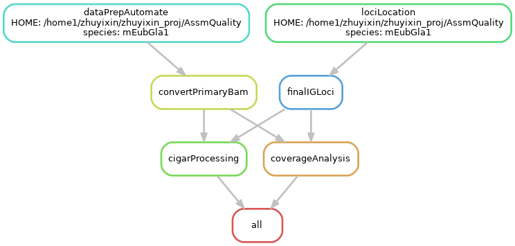

# IG Assembly Evaluation

**Brief description:** This project aims to evaluate the assembly of immunoglobulin (IG) sequences. The evaluation process includes various scripts and workflows to analyze, compare, and validate IG sequence assemblies.


## Table of Contents

- [Installation](#installation)
- [Usage](#usage)
- [Project Structure](#project-structure)

## Installation

Follow these steps to set up the development environment:

```bash
# Clone the repository
git clone https://github.com/yourusername/ig-assembly-eval.git

# Navigate to the project directory
cd ig-assembly-eval

# Create and activate the conda environment
conda env create -f assembly.yml
conda activate ig-assembly-eval
```

### Other Requirements

[IgDetective](https://github.com/Immunotools/IgDetective.git) is required for the following analysis.

## Usage
### Running the Pipeline



Use the Snakefile to run all the code located in the `code` folder. Above is an example pipeline overview for 1 species.

#### Required input files:

- HiFi fastq/BAM files that generated the assembly of the species of interest at `$HOME/$fastqdir/$species_name/`
- Merged diploid assembly fasta file of species of interest at `$HOME/assemblies/${species_name}.merged.fasta`
- Primary/Haplotype1/Maternal assembly fasta file of species of interest at `$HOME/assemblies/${species_name}.pri.fasta`
- Alternate/Haplotype2/Paternal assembly fasta file of species of interest at `$HOME/assemblies/${species_name}.alt.fasta`
- Above assembly files' index file `.fai`


#### Please make sure you modify the header lines of `Snakefile` to reflect your directory organization:

- `SPECIES = ["mEubGla1"]`, list of species name
- `fastqdir = ["hifi_fastq"]`,  sub-directory of your home directory where your fastq files are located
- `HAPLOID = ["False"]`,  if the list of species are halpid or not
- `HOME = "/home1/zhuyixin/zhuyixin_proj/AssmQuality"`,  your home directory

#### The output stats files will be in the `errorStats/` directory and should include the following 11 files:

- `IGH.txt`, read-oriented stats for both primary and alternate assembly at IGH locus
- `IGH_alt_pileup.txt`, mpileup file, basepair-oriented stats for alternate assembly at IGH locus
- `IGH_pri_pileup.txt`, mpileup file, basepair-oriented stats for primary assembly at IGH locus
- `IGK.txt`
- `IGK_alt_pileup.txt`
- `IGK_pri_pileup.txt`
- `IGL.txt`
- `IGL_pri_pileup.txt`
- `cigar.end`, empty flag file
- `pileup.end`, empty flag file
- `nonIG.txt`, read-oriented stats for both primary and alternate assembly at non-IG locus

```bash
# Run the main workflow using Snakemake
snakemake -R all --snakefile Snakefile --printshellcmds --reason --verbose --latency-wait 60000 --cores all
```
### Generating Visualizations and Error-Reporting Stats file

#### Optional input file:
- `species_metainfo.csv` containing meta information of the species of interest, format see example

After running the Snakefile, execute the python script `code/CloseRead.py` to generate visualizations and error-reporting stats file, stored in `errorPlots`.
```bash
python CloseRead.py [OPTIONS]
usage: CloseRead.py [-h] (--species s | --species_file sf) --gene g [--haploid h] --errorStatsDir dirStat --errorPlotsDir dirPlot [--lowCov_threshold cov] [--padding p]
                    [--single_read_error re] [--readview_correct_threshold rc] [--baseview_correct_threshold bc] [--meta m]

CloseRead Evaluation Stats and Visualization.

options:
  -h, --help            show this help message and exit
  --species s           Single species identifier (use this if you are providing one species)
  --species_file sf     Path to file containing a list of species (use this if you are providing multiple species)
  --gene g              Gene identifier(IGH/IGK/IGL)
  --haploid h           Haploid status (True/False) (alternate IG loci will not be shown if too short or has multiple)
  --errorStatsDir dirStat
                        Path to the previous errorStats directory containing mpileup file
  --errorPlotsDir dirPlot
                        Path to the output errorPlots directory
  --lowCov_threshold cov
                        Threshold for low coverage (default: 2)
  --padding p           Padding around low coverage regions (default: 2000bps)
  --single_read_error re
                        Threshold for a single read to consider as high mismatch (default: 0.01)
  --readview_correct_threshold rc
                        Number of high mismatch reads needed to cover a position for it to be considered as high mismatch rate position from read-view (default: 5)
  --baseview_correct_threshold bc
                        Threshold for the percent of reads with exact match at a position for it to be considered as well-supported, used in heatmap (default: 80 percent)
  --meta m              Absolute path to the meta information .csv file, used for generating pdf.
```

#### The output files will be in the `errorPlots/` directory and should include the following files:

- `summary.allreads.png`, summary evaluation of the general stats
- `length.png`, locus length plot
- `readcoverage.all.png`, coverage by read mapping quality across a genomic region, for both haplotype if diploid
- `basecoverage.PerCorrect.png`, basepair level coverage (% mismatch per position) and a heatmap of poorly supported positions, for both haplotype if diploid
- `break.txt` containing information for all low coverage positions
- `read.mismatch.txt` containing positional information for all high-mismatch rate region from read-view
- `base.exactmismatch.csv` containing detailed basepair-view mismatch information for every basepair with < bc (80% default) base support
- `base.avgmismatch.csv` containing averaged basepair-view mismatch information, grouping consecutive basepairs (< 1000bps spaced), best for identifying regions with lots of single base mismatches
- `finalMismatch.csv` containing positions marked highly mismacthed from both basepair-view and read-view, for both haplotype if diploid
- `result.pdf`, single pdf with all figures and meta information. 

### Folder Structure

A brief example overview of the project's structure and directories:

```plaintext
$HOME/
├── assemblies/          # Input assembly files
│   ├── mEubGla1.merged.fasta       # Example merged assembly
│   ├── mEubGla1.merged.fasta.fai   # Example merged assembly index
│   ├── mEubGla1.pri.fasta          # Example Primary/Haplotype1/Maternal assembly
│   ├── mEubGla1.pri.fasta.fai      # Example Primary/Haplotype1/Maternal assembly index
│   ├── mEubGla1.alt.fasta          # Example Alternate/Haplotype2/Paternal assembly
│   ├── mEubGla1.alt.fasta.fai      # Example Alternate/Haplotype2/Paternal assembly index
├── $fastqdir/           # Input fastq files
│   ├── mEubGla1              # Example dir containing fastq/bam files for mEubGla1
├── errorStats/          # Mismatch and coverage stats files
│   ├── mEubGla1              # Example dir containing output stats files for mEubGla1
├── errorPlots/          # Final visualizations
│   ├── mEubGla1              # Example dir containing output visualization files for mEubGla1
```

## Project Structure

```plaintext
ig-assembly-eval/
├── README.md          # Project documentation
├── Snakefile          # Main workflow file
├── assembly.yml       # Conda environment file
├── code/              # Source code and scripts
├── plots/             # Directory for plots and figures
├── curated_IGH/       # Directory for LJA curated IGH assembly
```
